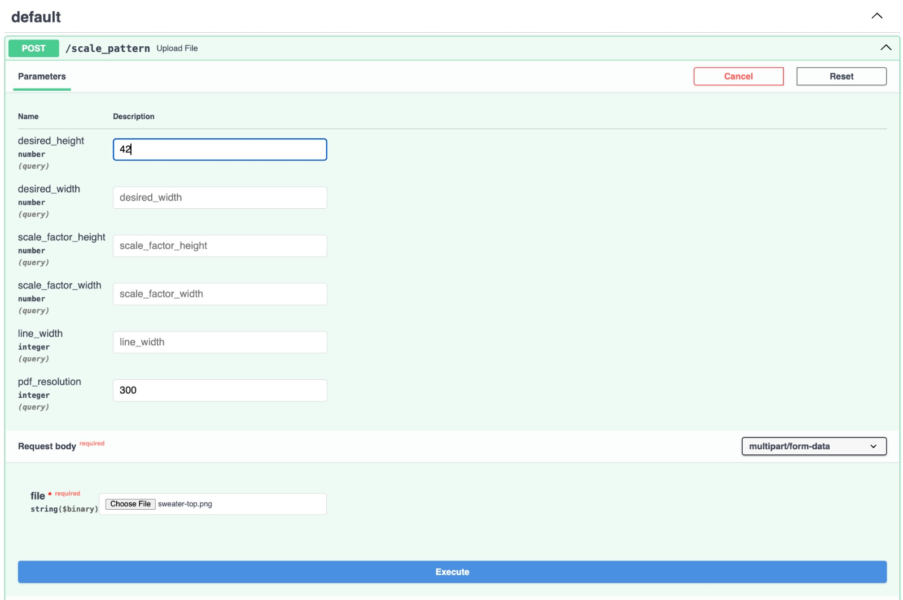
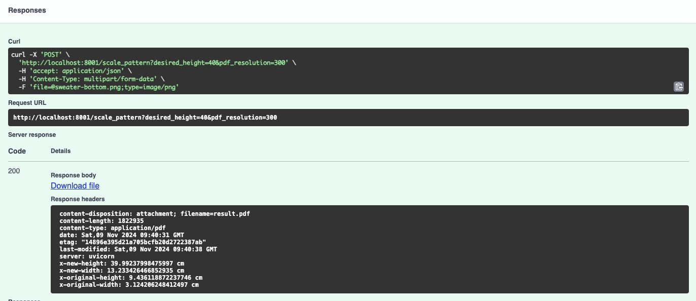

# Pattern Scaler

## Introduction
Pattern Scaler can be used to scale a pattern to a certain size and store it as a PDF with the pattern on printable A4 format. 

## How to use

Install poetry:

```
pip3 install poetry
```

Install the dependencies for the repository:

```
poetry install
```

## Run as API

Launch the API with

```
poetry run uvicorn --reload --host localhost --port 8001 "app.main:app"
```

You can make a post request to the API with an input file like this with curl:

```
curl -X POST -H "Content-Type: multipart/form-data" -F "file=@sweater-top.png" "http://localhost:8001/scale_pattern?desired_height=46" -o result.pdf
```

If successful, you can find the result.pdf in your project folder. 

Alternatively, you can go to http://localhost:8001/docs to open the interactive Swagger UI documentation.
Here you can click on **POST /scale_pattern** and then on **Try it out**. This allows to adjust the parameters and choose the PNG file with the image you want to scale from your local folder. 



Click **Execute**. If the call is successful you can click "Download file" to download the file: 



Alternatively you will find the generated result `result.pdf` in `./app/output-files/`.

> Note: for whatever reason, making the request from the Swagger UI twice in a row does not work me (it returns **Failed to fetch. Possible Reasons: - CORS, - ...**). To make it work I have to "choose file" again, select a different file and then revert back to the original file. Since this does not happen with curl I assume it is a Swagger UI related issue. If I find a solution for this behaviour I will make adjustments.

## Scaling other parts of the pattern

If your pattern consists of multiple parts, you can scale them equally by using the scale factor logged by the API. 

In the logs of the API you can see the following information when making a call:

```
Current size of image: 6.311912623825248 by 13.385826771653544 cm
Scale factor height: 3.4364705882352937
New size of image: 21.678943357886716 by 45.999491998984 cm
```

With the scale factor height we can scale the bottom part of the pattern the same way by calling:

```
curl -X POST -H "Content-Type: multipart/form-data" -F "file=@sweater-bottom.png" "http://localhost:8001/scale_pattern?scale_factor_height=3.4364705882352937" -o result-bottom.pdf
```

There always needs to be either a `desired_height` (or `desired_weight`) or a `scale_factor_height` (or `scale_factor_weight`) specified for the API call to work. 

## Note on PDF inputs

The pattern scaler works with PDF files as input, but I noticed the scale factor does not work correctly. Also, finding the correct resolution for a PDF is difficult (for my scanner it seems to be 304). This needs to be improved in the future.